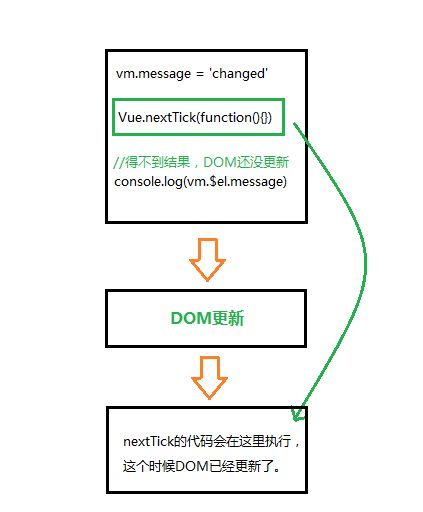

# Vue.nextTick 的原理和用途

## 概览

* 用法： 在下次 DOM 更新循环结束之后执行延迟回调。在修改数据之后立即使用这个方法，获取更新后的 DOM。

> 疑问：

1.  DOM 更新循环是指什么？

2.  下次更新循环是什么时候？

3.  修改数据之后使用，是加快了数据更新进度吗？

4.  在什么情况下要用到?

## 原理

### 异步说明

> Vue 实现响应式并不是数据发生变化之后 DOM 立即变化，而是按一定的策略进行 DOM 的更新。

在 Vue 的文档中，说明 Vue 是异步执行 DOM 更新的。

具体来说，异步执行的运行机制如下。

> 1.  所有同步任务都在主线程上执行，形成一个执行栈。
> 2.  主线程之外，还存在一个任务队列。只要异步任务有了运行结果，就在任务队列之中放置一个事件。
> 3.  一旦执行栈中的所有同步任务执行完毕，系统就会读取任务队列，看看里面有哪些事件。那些对应的异步任务，于是结束等待状态，进入执行栈，开始执行。
> 4.  主线程不断重复上面的第三步。

下面是主线程和任务队列的示意图。

;


## 事件循环说明

简单来说，Vue在修改数据后，视图不会立即更新，而是等待同一时间循环中的所有数据变化完成后，再统一进行视图更新。

知乎上的例子：

```js
//改编数据
vm.message = "changed"

// 想要立即使用更新后的DOM。这样不行，因为设置Message后DOM还没有更新。
console.log(vm.$el.textContent) // 并不会得到changed

// 这样可以，nextTick里面的代码会在DOM更新之后执行

Vue.nextTick(function(){
    console.log(vm.$el.textContent)  // 可以得到changed
})

```

图解:



> 事件循环：

第一个tick(图中第一个步骤,即'本次更新循环'):

1. 首先修改数据，这是同步任务。同一时间循环任务都在主线程上执行，形成一个执行栈，此时还未涉及DOM。
2. Vue开启一个异步队列，并缓存在此事件循环中发生的所有数据改变。如果同一个watcher被多次触发，只会被推入到队列中一次。

第二个tick(图例中第二个步骤，即"下次更新循环"):

同步任务执行完毕，开始执行异步watcher队列的任务，更新DOM。Vue在内部尝试对异步队列使用原生的Promise.then和MessageChannel方法，如果执行环境不支持，会采用setTimeout(fn,0)代替。

第三个tick(图例中第三个步骤):

此时就是文档所说的

> 下次DOM更新循环之后

此时通过Vue.nextTick获取到改变后的DOM。通过setTimeout(fn,0)也可以同样获取到。

简单总结事件循环：

同步代码执行->查找异步队列，推入执行栈，执行Vue.nextTick[事件循环1]->查找异步队列，推入执行站，执行Vue.nextTick[事件循环2]...

总之，异步是单独的一个tick,不会和同步在一个tick里发生，也是DOM不会马上改变的原因。

## 用途

> 应用场景：需要在视图更新之后，基于新的视图进行操作。

### created、mounted

需要注意的是，在created和mounted阶段，如果需要操作渲染后的视图，也要使用nextTick方法。

官方文档说明：

> 注意mounted不会承诺所有的子组件也都一起被挂在。如果你希望等到整个视图都渲染完毕，可以用vm.$nextTick替换掉mounted

```js

mounted:function(){
    this.$nextTick(function(){

    })
}

```
