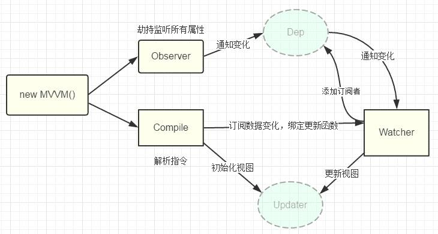

## Vue 双向数据绑定学习笔记

> 原文：[面试题：你能写一个 Vue 的双向数据绑定吗？](https://juejin.im/post/5acc17cb51882555745a03f8)

### 1. 原理

Vue 的双向数据绑定原理:**通过 object 对象的 definePrrperty 属性，重写 data 的 set 和 get 函数**

这里主要实现 v-model,v-bind 和 v-click 三个命令。


(图片来自网络，侵删)

### 2. 实现

页面结构如下:

```html
    <div id="app">
        <form action="">
            <input type="text" v-model="number">
            <button v-click="increment">增加</button>
        </form>
        <h3 v-bind="number"></h3>
    </div>
```

包含：

1.  一个 input 使用 v-model
2.  一个 button,使用 v-click
3.  一个 h3 使用 v-bind

我们最后会通过类似 vue 的方法来使用双向数据绑定，结合我们的数据结构添加注释:

```js
var app = new myVue({
  el:'#app',
  data:{
    number:0
  },
  methods:{
    increment:function(){
      this.number++;
    }
  }
})
```

首先我们需要定义一个myVue构造函数:

```js

function myVue(options){

}

```

为了初始化这个构造函数，给它添加一个_init属性

```js

function myVue(options) {
  this._init(options);
}
myVue.prototype._init = function (options) {
    this.$options = options;  // options 为上面使用时传入的结构体，包括el,data,methods
    this.$el = document.querySelector(options.el); // el是 #app, this.$el是id为app的Element元素
    this.$data = options.data; // this.$data = {number: 0}
    this.$methods = options.methods;  // this.$methods = {increment: function(){}}
  }

```

接下来实现_obverse函数，对data进行处理，重写data的set和get函数

并改造_init函数

```js
myVue.prototype._obverse = function (obj) { // obj = {number: 0}
    var value;
    for (key in obj) {  //遍历obj对象
      if (obj.hasOwnProperty(key)) {
        value = obj[key]; 
        if (typeof value === 'object') {  //如果值还是对象，则遍历处理
          this._obverse(value);
        }
        Object.defineProperty(this.$data, key, {  //关键
          enumerable: true,
          configurable: true,
          get: function () {
            console.log(`获取${value}`);
            return value;
          },
          set: function (newVal) {
            console.log(`更新${newVal}`);
            if (value !== newVal) {
              value = newVal;
            }
          }
        })
      }
    }
  }
 
 myVue.prototype._init = function (options) {
    this.$options = options;
    this.$el = document.querySelector(options.el);
    this.$data = options.data;
    this.$methods = options.methods;
   
    this._obverse(this.$data);
  }


```

接下来我们写一个指令类Watcher,用来绑定更新函数，实现对DOM元素的更新：

```js
function Watcher(name, el, vm, exp, attr) {
    this.name = name;         //指令名称，例如文本节点，该值设为"text"
    this.el = el;             //指令对应的DOM元素
    this.vm = vm;             //指令所属myVue实例
    this.exp = exp;           //指令对应的值，本例如"number"
    this.attr = attr;         //绑定的属性值，本例为"innerHTML"

    this.update();
  }

  Watcher.prototype.update = function () {
    this.el[this.attr] = this.vm.$data[this.exp]; //比如 H3.innerHTML = this.data.number; 当number改变时，会触发这个update函数，保证对应的DOM内容进行了更新。
  }

```

更新_init函数以及_obverse函数

```js
myVue.prototype._init = function (options) {
    //...
    this._binding = {};   //_binding保存着model与view的映射关系，也就是我们前面定义的Watcher的实例。当model改变时，我们会触发其中的指令类更新，保证view也能实时更新
    //...
  }
 
  myVue.prototype._obverse = function (obj) {
    //...
      if (obj.hasOwnProperty(key)) {
        this._binding[key] = {    // 按照前面的数据，_binding = {number: _directives: []}                                                                                                                                                  
          _directives: []
        };
        //...
        var binding = this._binding[key];
        Object.defineProperty(this.$data, key, {
          //...
          set: function (newVal) {
            console.log(`更新${newVal}`);
            if (value !== newVal) {
              value = newVal;
              binding._directives.forEach(function (item) {  // 当number改变时，触发_binding[number]._directives 中的绑定的Watcher类的更新
                item.update();
              })
            }
          }
        })
      }
    }
  }

```

接下来定义一个_compile函数，用来解析我们的指令(v-bind,v-model,v-click)等，并在这个过程中对view与model进行绑定。

```js

 myVue.prototype._init = function (options) {
   //...
    this._complie(this.$el);
  }
 
myVue.prototype._complie = function (root) { root 为 id为app的Element元素，也就是我们的根元素
    var _this = this;
    var nodes = root.children;
    for (var i = 0; i < nodes.length; i++) {
      var node = nodes[i];
      if (node.children.length) {  // 对所有元素进行遍历，并进行处理
        this._complie(node);
      }

      if (node.hasAttribute('v-click')) {  // 如果有v-click属性，我们监听它的onclick事件，触发increment事件，即number++
        node.onclick = (function () {
          var attrVal = nodes[i].getAttribute('v-click');
          return _this.$methods[attrVal].bind(_this.$data);  //bind是使data的作用域与method函数的作用域保持一致
        })();
      }

      if (node.hasAttribute('v-model') && (node.tagName == 'INPUT' || node.tagName == 'TEXTAREA')) { // 如果有v-model属性，并且元素是INPUT或者TEXTAREA，我们监听它的input事件
        node.addEventListener('input', (function(key) {  
          var attrVal = node.getAttribute('v-model');
           //_this._binding['number']._directives = [一个Watcher实例]
           // 其中Watcher.prototype.update = function () {
           //	node['vaule'] = _this.$data['number'];  这就将node的值保持与number一致
           // }
          _this._binding[attrVal]._directives.push(new Watcher(  
            'input',
            node,
            _this,
            attrVal,
            'value'
          ))

          return function() {
            _this.$data[attrVal] =  nodes[key].value; // 使number 的值与 node的value保持一致，已经实现了双向绑定
          }
        })(i));
      } 

      if (node.hasAttribute('v-bind')) { // 如果有v-bind属性，我们只要使node的值及时更新为data中number的值即可
        var attrVal = node.getAttribute('v-bind');
        _this._binding[attrVal]._directives.push(new Watcher(
          'text',
          node,
          _this,
          attrVal,
          'innerHTML'
        ))
      }
    }
  }


```